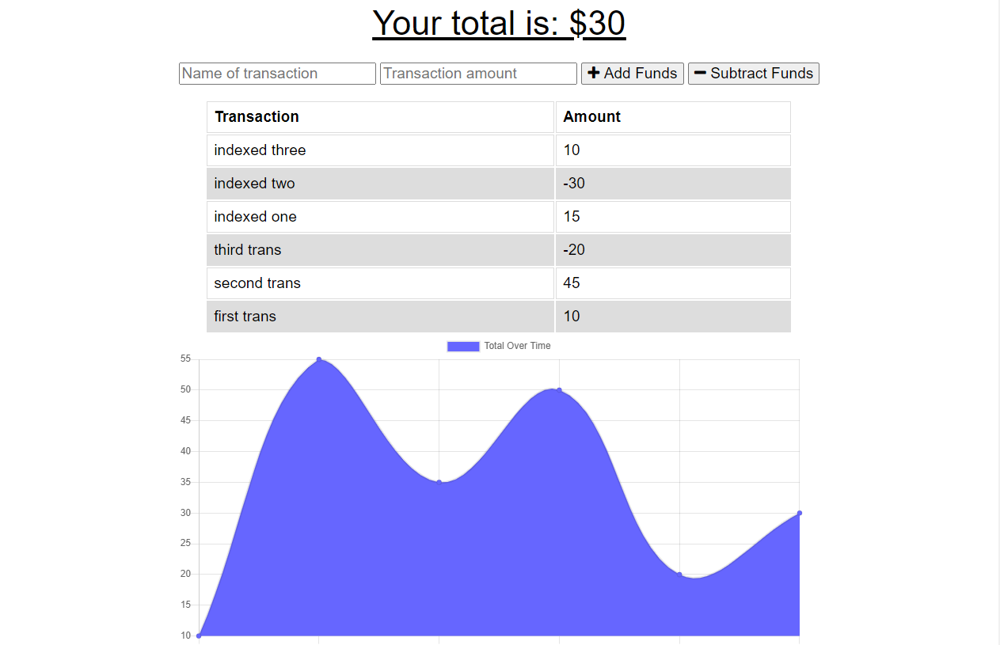

# Budget Tracker

## Table of Contents
* [Description](#description)
* [Installation](#installation)
* [Usage](#usage)
* [License](#license)
* [Contributors](#contributors)
* [Test](#test)
* [Questions](#questions)

## Description
This app is used to track your finances. Input the name and amount of your transaction and then choose to add or subtract those funds. The app will work online and offline, when you are offline your transactions will be stored in the indexedDB and when you come back online they will be added to your database.

## Installation 
You can visit the link of the deployed app: https://immense-mountain-80394.herokuapp.com/ or you can clone from github and run locally.

## Usage 
Enter the name of your transaction followed by the amount. Choose whether you would like to add those funds or subtract them and click the button. Your transaction will be added to a list and be reflected in the chart beneath. The app will work both online and offline.

## License

## Contributors
n/a

## Test
n/a

## Questions
For questions, you can contact the developer at:

Github:[millerrich]

Email:[william.miller.rich@gmail.com]